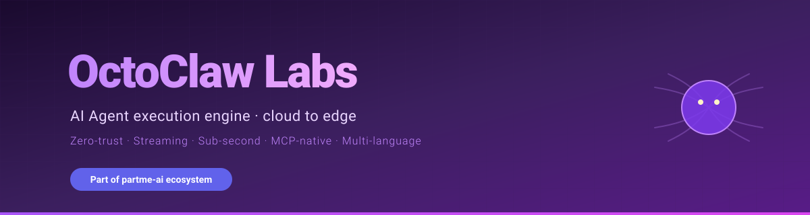

<p align="center">
  
</p>

# OctoClaw Labs

[](https://www.rust-lang.org)
[](https://openjdk.org)
[](https://python.org)
[](https://www.espressif.com)
[](LICENSE)

**章鱼架构 AI 智能体执行引擎 — 从云端到边缘的全栈 Agent 基础设施**

> 零信任 · 流式执行 · 亚秒响应 · 企业安全 · MCP 原生

---

## 关于我们

OctoClaw Labs 专注于 **AI 智能体执行引擎** 的研发，提供从云端到边缘的全栈 Agent 基础设施。核心设计理念是**章鱼架构** — 每个触手（Agent）独立运作，共享中枢神经系统（记忆/状态/通信）。

### 核心特性

- **零信任安全** — 企业级安全模型，端到端加密
- **流式执行** — Talk-while-executing，亚秒级响应
- **MCP 原生** — 原生支持 Model Context Protocol
- **多语言实现** — Rust / Java / Python，设计理论完全一致
- **边缘计算** — 支持 ESP32、树莓派、Jetson Nano 等边缘设备

---

## 项目矩阵

### 核心引擎

| 项目 | 语言 | 说明 |
|------|------|------|
| [octoclaw](https://github.com/octoclaw-labs/octoclaw) | Rust | 核心引擎 — 零信任流式 AI 执行引擎 |
| [octoclaw-4j](https://github.com/octoclaw-labs/octoclaw-4j) | Java | Java 实现 — 100% 兼容 OpenClaw 配置 |
| [octoclaw-pi](https://github.com/octoclaw-labs/octoclaw-pi) | Python | 轻量全栈版 — 专为树莓派/NAS/边缘节点设计 |

### 边缘与硬件

| 项目 | 语言 | 说明 |
|------|------|------|
| [octoclaw-esp32](https://github.com/octoclaw-labs/octoclaw-esp32) | C++ | ESP32 MCP 聊天机器人 |
| [octoclaw-edge](https://github.com/octoclaw-labs/octoclaw-edge) | Rust | 边缘运行时 — 树莓派/Jetson Nano |

### 通信与集群

| 项目 | 语言 | 说明 |
|------|------|------|
| [octoclaw-nats](https://github.com/octoclaw-labs/octoclaw-nats) | Rust | 集群通信中枢 — NATS 原生 Leaf Node 架构 |

### 插件生态

| 项目 | 语言 | 说明 |
|------|------|------|
| [octoclaw-plugins](https://github.com/octoclaw-labs/octoclaw-plugins) | TypeScript | OctoClaw 插件集合 |
| [octoclaw-pi-plugins](https://github.com/octoclaw-labs/octoclaw-pi-plugins) | Python | OctoClaw-Pi 插件集合 |
| [octoclaw-4j-plugins](https://github.com/octoclaw-labs/octoclaw-4j-plugins) | Java | OctoClaw-4j 插件集合 |

### Android 自动化

| 项目 | 语言 | 说明 |
|------|------|------|
| [claw-adb-swarm](https://github.com/octoclaw-labs/claw-adb-swarm) | Rust | Android 设备群控引擎 — ADB/UI/Macro + MCP/REST/CLI |
| [claw-android-bridge](https://github.com/octoclaw-labs/claw-android-bridge) | Kotlin | Android 自动化键盘 — UI 自动化/截图/手势/事件流 |
| [claw-scrcpy-swarm](https://github.com/octoclaw-labs/claw-scrcpy-swarm) | Rust | scrcpy 设备群控 |

---

## 架构概览

```
┌─────────────────────────────────────────────────────────────┐
│                    云端 (Cloud)                              │
│  ┌─────────────┐  ┌─────────────┐  ┌─────────────┐         │
│  │  OctoClaw   │  │ OctoClaw-4j │  │ OctoClaw-Pi │         │
│  │   (Rust)    │  │   (Java)    │  │  (Python)   │         │
│  └──────┬──────┘  └──────┬──────┘  └──────┬──────┘         │
│         └────────────────┼────────────────┘                 │
│                          │                                  │
│              ┌───────────▼───────────┐                     │
│              │   OctoClaw-NATS       │                     │
│              │   集群通信中枢         │                     │
│              └───────────┬───────────┘                     │
└──────────────────────────┼──────────────────────────────────┘
                           │
┌──────────────────────────┼──────────────────────────────────┐
│                    边缘 (Edge)                               │
│  ┌──────────────┐  ┌──────▼──────┐  ┌──────────────┐       │
│  │  ESP32       │  │  树莓派     │  │  Jetson Nano │       │
│  │  OctoClaw   │  │  OctoClaw  │  │  OctoClaw   │       │
│  │  -ESP32     │  │  -Edge     │  │  -Edge      │       │
│  └──────────────┘  └─────────────┘  └──────────────┘       │
└─────────────────────────────────────────────────────────────┘
```

---

## 技术栈

| 层级 | 技术 |
|------|------|
| **核心引擎** | Rust (tokio) · Java (Spring Boot) · Python (asyncio) |
| **通信** | NATS · WebSocket · MCP Protocol · REST API |
| **AI 集成** | OpenClaw · LLMs · Agent Skills · Function Calling |
| **边缘** | ESP-IDF · Raspberry Pi OS · JetPack |
| **Android** | ADB · scrcpy · UI Automator · Accessibility |

---

## 快速开始

### OctoClaw (Rust)

```bash
git clone https://github.com/octoclaw-labs/octoclaw.git
cd octoclaw
cargo build --release
```

### OctoClaw-4j (Java)

```bash
git clone https://github.com/octoclaw-labs/octoclaw-4j.git
cd octoclaw-4j
mvn clean package
```

### OctoClaw-Pi (Python)

```bash
git clone https://github.com/octoclaw-labs/octoclaw-pi.git
cd octoclaw-pi
pip install -r requirements.txt
python main.py
```

### ESP32

```bash
git clone https://github.com/octoclaw-labs/octoclaw-esp32.git
cd octoclaw-esp32
# Follow ESP-IDF setup guide
idf.py build
```

---

## 相关生态

| 项目 | 说明 |
|------|------|
| [PartMe AI](https://github.com/partme-ai) | AI 智能体生态组织 |
| [OpenClaw](https://github.com/partme-ai/openclaw) | AI Agent 网关 |
| [Full Stack Skills](https://github.com/partme-ai/full-stack-skills) | 454 个 Agent Skills |

---

## 贡献指南

欢迎贡献！每个子项目都有独立的贡献指南。

1. **Fork** 目标仓库
2. 创建特性分支
3. 提交 PR

---

## 联系我们

- Email: [partmeai@gmail.com](mailto:partmeai@gmail.com)
- GitHub: [github.com/octoclaw-labs](https://github.com/octoclaw-labs)

---

<div align="center">

**章鱼架构 · 从云端到边缘的全栈 Agent 基础设施**

Made with ❤️ by OctoClaw Labs

</div>
